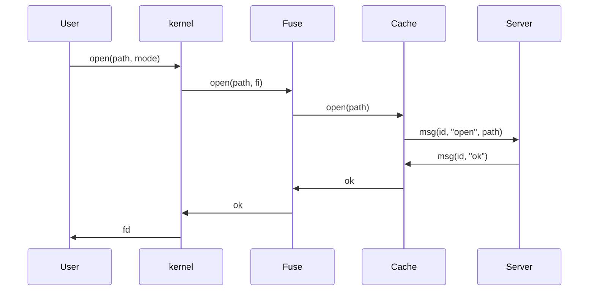
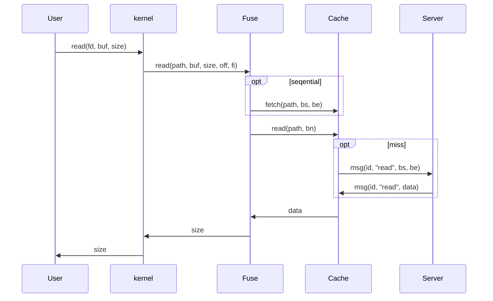
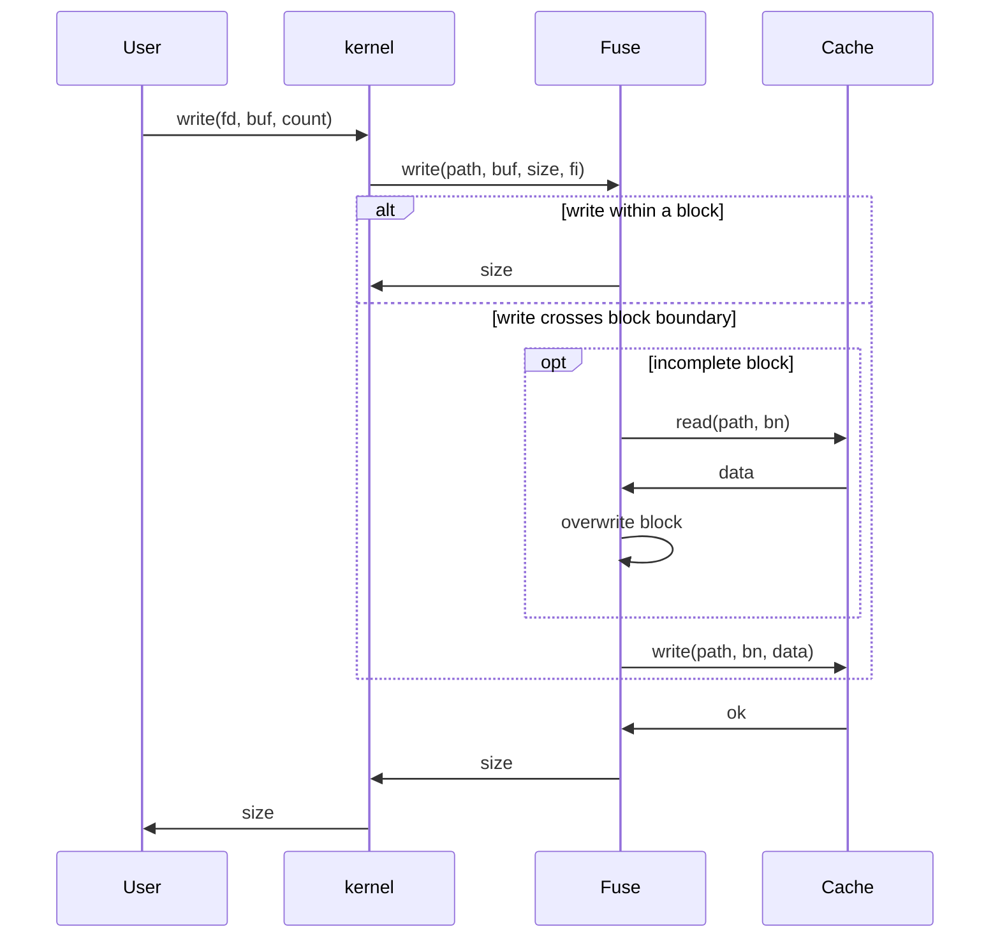
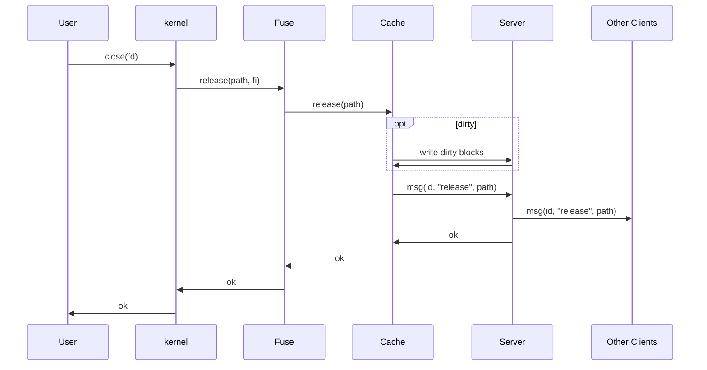
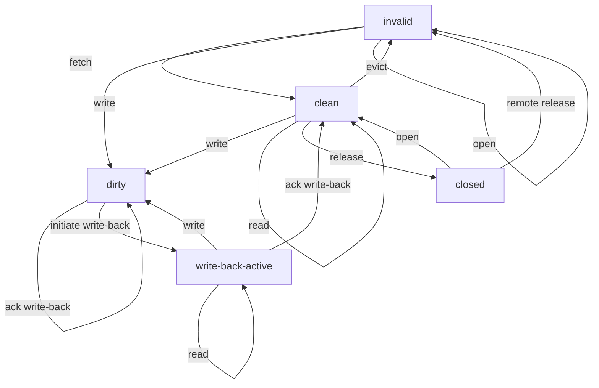

# FUSE Info

## Operations

From docs:

The file system operations:

Most of these should work very similarly to the well known UNIX file system operations.  A major exception is that instead of returning an error in `errno`, the operation should return the negated error value (`-errno`) directly.

All methods are optional, but some are essential for a useful filesystem (e.g. `getattr`).  `open`, `flush`, `release`, `fsync`, `opendir`, `releasedir`, `fsyncdir`, `access`, `create`, `truncate`, `lock`, `init` and `destroy` are special purpose methods, without which a full featured filesystem can still be implemented.

In general, all methods are expected to perform any necessary permission checking. However, a filesystem may delegate this task to the kernel by passing the `default_permissions` mount option to `fuse_new()`. In this case, methods will only be called if the kernel's permission check has succeeded.

Almost all operations take a path which can be of any length.

### struct fuse_operations

| Name          | Arguments                              | comment                                                      | need?                    |
| ------------- | -------------------------------------- | ------------------------------------------------------------ | ------------------------ |
| `getattr`     | `path, stat, fi`                       | `stat` is the output; contains mode, length, etc.            | y       |
| `readlink`    | `path`, `buf`, `buf_size`              | `buf` is filled with link target                             | o           |
| `mknod`       | `path`, `mode`, `dev`                  | create special files like char, block, etc.                  | n |
| `mkdir`       | `path`, `mode`                         | create a directory                                           | y       |
| `unlink`      | `path`                                 | remove a file                                                | y       |
| `rmdir`       | `path`                                 | rm a directory                                               | y       |
| `symlink`     | `target`, `linkpath`                   | create a symbolic link                                       | o           |
| `rename`      | `oldpath`,`newpath`                    | rename                                                       | y       |
| `link`        | `oldpath`, `newpath`                   | create a hard link                                           | o           |
| `chmod`       | `path`, `mode`, `fi`                   | chmod                                                        | n |
| `chown`       | `path`, `uid`, `gid`, `fi`             | chown                                                        | n |
| `truncate`    | `path`, `size`, `fi`                   | change file size                                             | y       |
| `open`        | `path`, `fi`                           | see [docs](#open)                                            | y       |
| `read`        | `path`, `buf`, `size`, `offset`,`fi`   | read                                                         | y       |
| `write`       | `path`,`buf`,`size`,`fi`               | write                                                        | y       |
| `statfs`      | `path`, `statvfs`                      | info of this filesystem                                      | o           |
| `flush`       | `path`, `fi`                           | called before close. see [docs](#flush)                      | y       |
| `release`     | `path`, `fi`                           | called when no open fd for a file exists                     | y       |
| `fsync`       | `path`, `?`, `fi`                      | write back dirty data                                        | y       |
| `setxattr`    | ...                                    | extended attr                                                | n |
| `getxattr`    | ...                                    |                                                              | n |
| `listxattr`   | ...                                    |                                                              | n |
| `removexattr` | ...                                    |                                                              | n |
| `opendir`     | `path`, `fi`                           | open directory                                               | y       |
| `readdir`     | `path`, `buf`, `filler`, `fi`, `flags` | read directory entries                                       | y       |
| `releasedir`  | `path`, `fi`                           | release directory                                            | y       |
| `fsyncdir`    | `path`, `?`, `fi`                      | write back dirty data                                        | y       |
| `init`        | `connection`,`config`                  | a chance to pass private data to context                     | y       |
| `destroy`     | `private_data`                         | filesystem exits                                             | y       |
| `access`      | `path`, `?`                            | check permission (not called if we let kernel handles permissions) | n |
| `create`      | `path`, `mode`, `fi`                   | create and open                                              | y       |
| `lock`        | `path`, `fi`, `cmd`, `flock`           | lock file                                                    | o           |
| `utimens`     | `path`, `time`, `fi`                   | change access and modification time                          | o           |
| `bmap`        | ...                                    | block mapping                                                | n |
| `ioctl`       | ...                                    | the ultimate cmd                                             | n |
| `poll`        | ...                                    | poll io events                                               | n |
| `write_buf`   | ...                                    | similar to write                                             | n |
| `read_buf`    | ...                                    | similar to read                                              | n |
| `flock`       | ...                                    | bsd locking                                                  | o           |
| `fallocate`   | ...                                    | reserve space for files                                      | n |

### Explanation from Docs

#### open

Open a file

Open flags are available in fi->flags. The following rules apply.

- Creation (O_CREAT, O_EXCL, O_NOCTTY) flags will be filtered out / handled by the kernel.
- Access modes (O_RDONLY, O_WRONLY, O_RDWR) should be used by the filesystem to check if the operation is permitted. If the `-o default_permissions` mount option is given, this check is already done by the kernel before calling [open()](http://libfuse.github.io/doxygen/structfuse__operations.html#a14b98c3f7ab97cc2ef8f9b1d9dc0709d) and may thus be omitted by the filesystem.
- When writeback caching is enabled, the kernel may send read requests even for files opened with O_WRONLY. The filesystem should be prepared to handle this.
- When writeback caching is disabled, the filesystem is expected to properly handle the O_APPEND flag and ensure that each write is appending to the end of the file.
- When writeback caching is enabled, the kernel will handle O_APPEND. However, unless all changes to the file come through the kernel this will not work reliably. The filesystem should thus either ignore the O_APPEND flag (and let the kernel handle it), or return an error (indicating that reliably O_APPEND is not available).

Filesystem may store an arbitrary file handle (pointer, index, etc) in fi->fh, and use this in other all other file operations (read, write, flush, release, fsync).

Filesystem may also implement stateless file I/O and not store anything in fi->fh.

There are also some flags (direct_io, keep_cache) which the filesystem may set in fi, to change the way the file is opened. See [fuse_file_info](http://libfuse.github.io/doxygen/structfuse__file__info.html) structure in <fuse_common.h> for more details.

If this request is answered with an error code of ENOSYS and FUSE_CAP_NO_OPEN_SUPPORT is set in `fuse_conn_info.capable`, this is treated as success and future calls to open will also succeed without being send to the filesystem process.

#### flush

Possibly flush cached data

BIG NOTE: This is not equivalent to [fsync()](http://libfuse.github.io/doxygen/structfuse__operations.html#a92bdd6f43ba390a54ac360541c56b528). It's not a request to sync dirty data.

Flush is called on each close() of a file descriptor. So if a filesystem wants to return write errors in close() and the file has cached dirty data, this is a good place to write back data and return any errors. Since many applications ignore close() errors this is not always useful.

NOTE: The [flush()](http://libfuse.github.io/doxygen/structfuse__operations.html#ad4ec9c309072a92dd82ddb20efa4ab14) method may be called more than once for each [open()](http://libfuse.github.io/doxygen/structfuse__operations.html#a14b98c3f7ab97cc2ef8f9b1d9dc0709d). This happens if more than one file descriptor refers to an opened file due to dup(), dup2() or fork() calls. It is not possible to determine if a flush is final, so each flush should be treated equally. Multiple write-flush sequences are relatively rare, so this shouldn't be a problem.

Filesystems shouldn't assume that flush will always be called after some writes, or that if will be called at all.

### Summary

Operations we must implement:

| Name         | Priority |
| ------------ | -------- |
| `getattr`    | 1        |
| `mkdir`      | 2        |
| `unlink`     | 2        |
| `rmdir`      | 2        |
| `rename`     | 2        |
| `truncate`   | 2        |
| `create`     | 2        |
| `open`       | 1        |
| `read`       | 1        |
| `write`      | 1        |
| `flush`      | 1        |
| `fsync`      | 2        |
| `release`    | 2        |
| `opendir`    | 1        |
| `readdir`    | 1        |
| `releasedir` | 1        |
| `fsyncdir`   | 2        |
| `init`       | 1        |
| `destroy`    | 1        |

Cache data structure:

`hash_map( (full_path, block_num), (dirty, access_time, block_data))`

write

close

cache state

